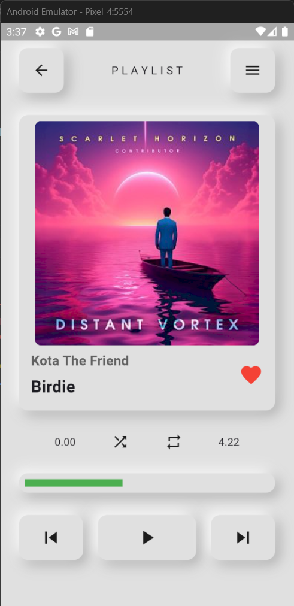

# 🎵 **Flutter Music Player App**

A cross-platform music player built with **Flutter**, supporting Android, iOS, Web, Windows, Linux, and macOS. Sleek, responsive UI with seamless playback features and a modern design.

---

## 🖼️ **UI Design Preview**

---

## 🚀 **Features**

- 🎧 Beautiful and minimal music player interface
- 📁 Local audio file support (MP3, WAV, etc.)
- ⏯️ Play, Pause, Skip, Seek functionality
- 🎵 Track metadata display (title, artist, duration)
- 🌙 Light and Dark mode support
- 🖥️ Responsive layout for desktop, web, and mobile
- 📱 Runs on Android, iOS, Linux, Windows, macOS, and Web

---

## 🤝 **Contributing**
Contributions, issues, and feature requests are welcome!
Feel free to fork this repo and submit a pull request.

---

## 👤 **Author**
Developed with ❤️ by Jayanidu Abeysinghe
GitHub: @Jayanidu-Abeysinghe

